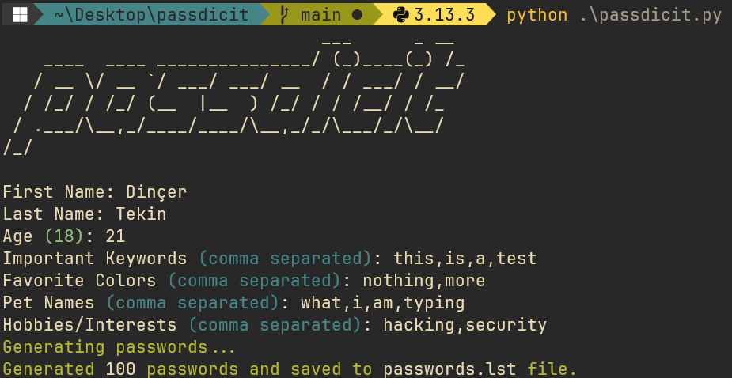

# Passdict


passdict is a Python-based tool that generates personalized password lists based on information like name, surname, hobbies, and favorite movies. Useful for security research and understanding how personal data can be used to guess passwords. Inspired by [cupp](https://github.com/Mebus/cupp).

> This tool is intended for educational purposes only. The author is not responsible for any illegal use.

## Screenshots



## Tech Stack

| Layer | Tool |
|---|---|
| Language | Python 3 |
| Package Manager | pip / Poetry |
| Platform | Linux |

## Installation

1. Clone the repository:
   ```bash
   git clone https://github.com/dincertekin/passdict.git
   cd passdict/
   ```

2. Install dependencies using pip or Poetry:
   ```bash
   pip install -r requirements.txt
   # or
   poetry install
   ```

## Usage

```bash
python passdict.py
```

If you run into dependency issues, make sure pip is up to date:
```bash
pip install --upgrade pip
```

## Contributing

Contributions are welcome! To get started:

1. Fork the repository.
2. Create a new branch (`git checkout -b feature/your-feature`).
3. Commit your changes (`git commit -m 'Add your feature'`).
4. Push to the branch (`git push origin feature/your-feature`).
5. Open a Pull Request.

For major changes, please open an issue first to discuss what you'd like to change.

## License

[MIT License](./LICENSE)
