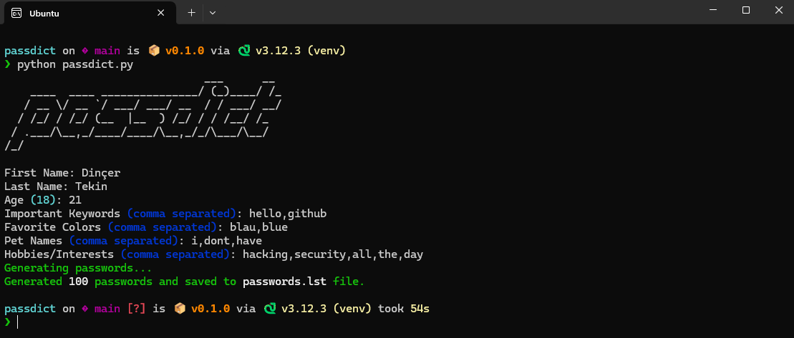

# passdict
Passdict is a tool for making password lists. It asks questions about your name, surname, gender, hobbies, and favorite movies. Then, it uses this information to create unique passwords.
**NOTE:** This tool is designed for educational purposes only, author is not responsible for illegal uses.

## Screenshots


## Installation
There is two different ways to install passdict, using pypoetry and using only pip.

#### Installing with pip
Use these commands on Linux:
```bash
git clone https://github.com/dincertekin/passdict.git
cd passdict/
pip install -r requirements.txt
python passdict.py
```

#### Installing with pypoetry
Use these commands on Linux:
```bash
git clone https://github.com/dincertekin/passdict.git
cd passdict/
poetry install
python passdict.py
```

## Contributions
Contributions are very welcome! We can improve this tool together! 😊

## License
This project is licensed under [Apache-2.0 License](LICENSE).

## Thanks
This project is inspired by Mebus's [cupp](https://github.com/Mebus/cupp).
